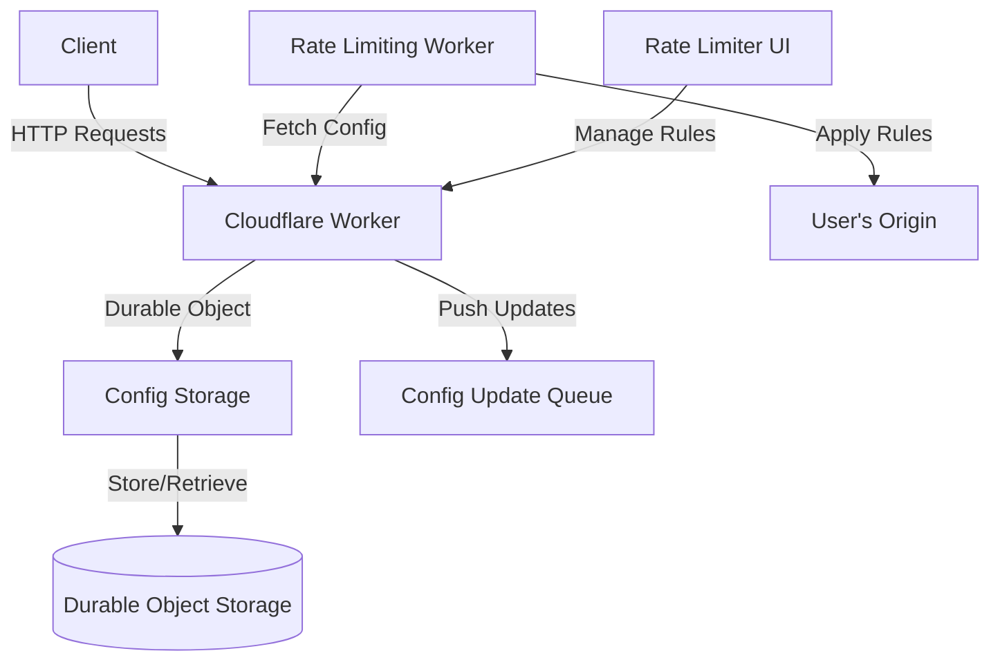

# Rate Limiter Config Storage

## Table of Contents
1. [Overview](#overview)
2. [Project Structure](#project-structure)
3. [System Architecture](#system-architecture)
4. [Key Components](#key-components)
5. [API Endpoints](#api-endpoints)
6. [Workflow](#workflow)
7. [Configuration](#configuration)
8. [Development](#development)
9. [Deployment](#deployment)
10. [Future Enhancements](#future-enhancements)
11. [Recent Improvements](#recent-improvements)
12. [Related Components](#related-components)

## Overview

The Rate Limiter Config Storage is a Cloudflare Worker that implements a configuration storage system for a rate-limiting service. It provides a RESTful API for managing rate-limiting rules, which can be applied to various endpoints or zones in a Cloudflare environment.

The service is built using TypeScript, implementing a layered architecture with clear separation of concerns:
1. **Handlers** process HTTP requests and route them to appropriate operations
2. **Operations** implement business logic for managing rate limiting rules
3. **Services** provide core functionality like data storage and request routing
4. **Utilities** offer cross-cutting concerns like logging and performance tracking

## Project Structure

```
rate-limiter-config-storage/
├── src-ts/                   # TypeScript source code (primary)
│   ├── constants/            # Application constants
│   ├── core/                 # Core functionality
│   │   └── storage.ts        # Main ConfigStorage Durable Object
│   ├── handlers/             # HTTP request handlers
│   │   ├── getHandler.ts     # GET request handler
│   │   ├── postHandler.ts    # POST request handler
│   │   ├── putHandler.ts     # PUT request handler
│   │   └── deleteHandler.ts  # DELETE request handler
│   ├── operations/           # Business operations
│   │   ├── deleteRule.ts     # Delete rule operation
│   │   ├── getRule.ts        # Get rule operation
│   │   ├── reorderRule.ts    # Reorder rules operation
│   │   ├── revertRule.ts     # Revert rule operation
│   │   └── updateRule.ts     # Update rule operation
│   ├── services/             # Service layer
│   │   ├── config-service.ts # Configuration management service
│   │   └── router-service.ts # Request routing service
│   ├── types/                # TypeScript type definitions
│   ├── utils/                # Utility functions
│   │   ├── logger/           # Logging utilities
│   │   ├── validation/       # Validation utilities
│   │   └── performance/      # Performance tracking utilities
│   └── index.ts              # Main entry point
├── test-ts/                  # TypeScript tests
├── src/                      # Auto-generated JavaScript code
├── dist/                     # Compiled JavaScript output
├── wrangler.toml             # Wrangler configuration
├── tsconfig.json             # TypeScript configuration
├── package.json              # Project dependencies
└── openapi.yaml              # API specification
```

## System Architecture



## Key Components

1. **ConfigStorage Class**: The main Durable Object class that handles storage and retrieval of rate-limiting rules.
2. **ConfigService**: A service responsible for managing configuration data, implementing caching, versioning, and data operations.
3. **RouterService**: A service responsible for routing HTTP requests to appropriate handlers.
4. **Request Handlers**: Modules for handling specific HTTP methods (GET, POST, PUT, DELETE).
5. **Operations**: Business logic modules that implement specific rule management operations.
6. **Logger**: A structured logging utility with support for different log levels and formatted output.
7. **Performance Tracking**: Utilities for measuring and tracking execution times of operations.
8. **Type System**: TypeScript interfaces and types for improved code safety and documentation.
9. **Validation**: Utilities for validating rule structure and input data.

## API Endpoints

| Method | Endpoint | Description |
|--------|----------|-------------|
| GET    | /config  | Retrieve all rate-limiting rules (supports pagination with query params: page, limit) |
| POST   | /config  | Add a new rate-limiting rule |
| PUT    | /config/rules/{ruleId} | Update an existing rule |
| DELETE | /config/rules/{ruleId} | Delete a rule |
| PUT    | /config/reorder | Reorder existing rules |
| PUT    | /config/rules/{ruleId}/revert | Revert a rule to a previous version |
| GET    | /config/rules/{ruleId}/versions | Get version history for a rule (supports pagination with query params: page, limit) |
| GET    | /export  | Export all configuration data (rules and version history) |

## Workflow

1. **Rule Creation**:
   ```mermaid
   sequenceDiagram
       participant Client
       participant Worker
       participant ConfigStorage
       participant Queue
       Client->>Worker: POST /config (new rule)
       Worker->>ConfigStorage: Store new rule
       ConfigStorage->>ConfigStorage: Assign ID and version
       ConfigStorage->>Worker: Confirm storage
       Worker->>Queue: Push config update
       Worker->>Client: Return new rule details
   ```

2. **Rule Retrieval**:
   ```mermaid
   sequenceDiagram
       participant Client
       participant Worker
       participant ConfigStorage
       Client->>Worker: GET /config
       Worker->>ConfigStorage: Fetch all rules
       ConfigStorage->>Worker: Return rules
       Worker->>Client: Send rules as JSON
   ```

3. **Rule Update**:
   ```mermaid
   sequenceDiagram
       participant Client
       participant Worker
       participant ConfigStorage
       participant Queue
       Client->>Worker: PUT /config/rules/{ruleId}
       Worker->>ConfigStorage: Update rule
       ConfigStorage->>ConfigStorage: Increment version
       ConfigStorage->>Worker: Confirm update
       Worker->>Queue: Push config update
       Worker->>Client: Return updated rule
   ```

## Configuration

The project uses `wrangler.toml` for configuration with separate environments:

```toml
name = "rate-limiter-config-storage"
main = "dist/index.js"
compatibility_date = "2024-09-25"

account_id = "25f21f141824546aa72c74451a11b419"
workers_dev = true

[build]
command = "npm run build"

[placement]
mode = "smart"

[observability]
enabled = true

# Production environment
[env.production]
route = { pattern = "api.rate-limiter.erfianugrah.com", custom_domain = true, zone_id = "3f2c4daa43d5920f313654a873b31d06" }

[[env.production.queues.producers]]
binding = "CONFIG_QUEUE"
queue = "config-update-queue"

# Staging environment
[env.staging]
name = "rate-limiter-config-storage-staging"
route = { pattern = "api-staging.rate-limiter.erfianugrah.com", custom_domain = true, zone_id = "3f2c4daa43d5920f313654a873b31d06" }

[[env.staging.queues.producers]]
binding = "CONFIG_QUEUE"
queue = "config-update-queue-staging"

# Durable Objects configuration
[durable_objects]
bindings = [
  { name = "CONFIG_STORAGE", class_name = "ConfigStorage" }
]

[[migrations]]
tag = "v1"
new_classes = ["ConfigStorage"]
```

## Development

1. Clone the repository:
   ```
   git clone https://github.com/erfianugrah/rate-limiter-config-storage.git
   cd rate-limiter-config-storage
   ```

2. Install dependencies:
   ```
   npm install
   ```

3. TypeScript type checking:
   ```
   npm run check
   ```

4. Run ESLint for code quality:
   ```
   npm run lint
   ```

5. Run the development server:
   ```
   npm run dev
   ```

6. Run tests:
   ```
   npm run test       # All tests
   npm run test:ts    # TypeScript tests only
   ```

7. Build the project:
   ```
   npm run build
   ```

## Deployment

### Production

Deploy the worker to the production environment:

```
npm run deploy
```

### Staging

Deploy the worker to the staging environment:

```
npm run deploy:staging
```

The staging environment is configured with a separate domain and queue for isolated testing.

## Future Enhancements

1. ✅ ~~Complete the conversion of remaining handlers to TypeScript.~~ (Completed)
2. Implement authentication and authorization for the configuration API.
3. ✅ ~~Enhance the test suite with more comprehensive coverage~~ (Completed)
4. ✅ ~~Implement more sophisticated caching strategies to further reduce latency.~~ (Completed)
5. ✅ ~~Add support for bulk operations (export of rule configurations).~~ (Completed)
6. Add support for bulk import of rule configurations.
7. Implement analytics and reporting features for rate limiting activities.
8. Add support for advanced rate limiting scenarios (e.g., gradual throttling).
9. ✅ ~~Implement automatic rule validation with more sophisticated schemas.~~ (Completed)
10. ✅ ~~Improve type definitions:~~ (Completed)
    - ✅ ~~Use more specific types instead of generic Record<string, unknown>~~
    - ✅ ~~Make enums stricter where possible~~
11. ✅ ~~Refine architecture:~~ (Completed)
    - ✅ ~~Consider consolidating duplicated logic between handlers and operations~~ (Improved with better storage approach)
    - ✅ ~~Evaluate if separate operations layer adds value~~ (Maintained for separation of concerns)
12. ✅ ~~Add pagination support for listing rules and versions~~ (Completed)

## Recent Improvements

Several major improvements have been implemented to enhance the performance, reliability, and maintainability of the Rate Limiter Config Storage service:

1. **Individual Rule Storage**: Rules are now stored as separate entries in Durable Object storage instead of one large JSON blob, significantly improving scalability for large rule sets.

2. **Enhanced Validation**: Comprehensive validation system with detailed error reporting for all rule components, ensuring data integrity and providing better user feedback.

3. **Improved Test Coverage**: Expanded test suite with high coverage for core components, ensuring reliability and facilitating future development.

4. **Performance Optimization**: Parallel operations and better caching mechanisms for improved throughput.

5. **Data Reliability**: Enhanced error handling, consistent timestamp management, and improved version history tracking.

6. **Code Cleanup**: Complete removal of JavaScript code and reliance on TypeScript-only codebase.

7. **TypeScript Integration**: All improvements have been integrated into the TypeScript codebase to ensure type safety and better developer experience.

8. **Automatic Migration**: Added automatic migration capability to seamlessly transition from old storage format to the new individual rule storage format.

9. **Pagination Support**: Added pagination for listing rules and rule versions, improving performance for large data sets.

10. **Export Functionality**: Added the ability to export the entire configuration, including all rules and their versions, as a JSON file.

11. **OpenAPI Documentation**: Complete API documentation with support for the new pagination and export functionality.

See the [IMPROVEMENTS.md](./IMPROVEMENTS.md) file for detailed information about these changes.

## Related Components

This Config Storage Worker is part of a larger rate limiting system. The other components are:

1. [Rate Limiter UI](https://github.com/erfianugrah/rate-limiter-ui): Provides a user interface for managing rate limiting rules.
2. [Rate Limiting Worker](https://github.com/erfianugrah/rate-limiter-worker): Applies the rate limiting rules to incoming requests.

For a complete setup, ensure all components are properly configured and deployed.
