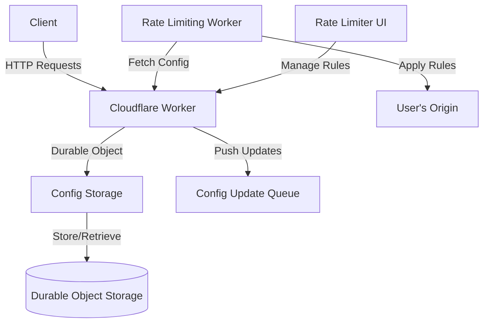

# Rate Limiter Config Storage

## Table of Contents
1. [Overview](#overview)
2. [Project Structure](#project-structure)
3. [System Architecture](#system-architecture)
4. [Key Components](#key-components)
5. [API Endpoints](#api-endpoints)
6. [Workflow](#workflow)
7. [Configuration](#configuration)
8. [Development](#development)
9. [Deployment](#deployment)
10. [Future Enhancements](#future-enhancements)
11. [Related Components](#related-components)

## Overview

The Rate Limiter Config Storage is a Cloudflare Worker that implements a configuration storage system for a rate-limiting service. It provides a RESTful API for managing rate-limiting rules, which can be applied to various endpoints or zones in a Cloudflare environment.

## Project Structure

```
rate-limiter-config-storage/
├── src/
│   ├── index.js
│   ├── config-storage.js
│   ├── utils.js
│   ├── handlers/
│   │   ├── getHandler.js
│   │   ├── postHandler.js
│   │   ├── putHandler.js
│   │   └── deleteHandler.js
│   └── operations/
│       ├── deleteRule.js
│       ├── getRule.js
│       ├── reorderRule.js
│       ├── revertRule.js
│       └── updateRule.js
├── wrangler.toml
├── package.json
└── openapi.yaml
```

## System Architecture



## Key Components

1. **ConfigStorage Class**: The main Durable Object class that handles storage and retrieval of rate-limiting rules.
2. **Request Handlers**: Separate modules for handling GET, POST, PUT, and DELETE requests.
3. **Rule Operations**: Modules for specific operations like updating, deleting, reordering, and reverting rules.
4. **Utility Functions**: Helper functions for validation, logging, and config updates.

## API Endpoints

| Method | Endpoint | Description |
|--------|----------|-------------|
| GET    | /config  | Retrieve all rate-limiting rules |
| POST   | /config  | Add a new rate-limiting rule |
| PUT    | /config/rules/{ruleId} | Update an existing rule |
| DELETE | /config/rules/{ruleId} | Delete a rule |
| PUT    | /config/reorder | Reorder existing rules |
| PUT    | /config/rules/{ruleId}/revert | Revert a rule to a previous version |
| GET    | /config/rules/{ruleId}/versions | Get version history for a rule |

## Workflow

1. **Rule Creation**:
   ```mermaid
   sequenceDiagram
       participant Client
       participant Worker
       participant ConfigStorage
       participant Queue
       Client->>Worker: POST /config (new rule)
       Worker->>ConfigStorage: Store new rule
       ConfigStorage->>ConfigStorage: Assign ID and version
       ConfigStorage->>Worker: Confirm storage
       Worker->>Queue: Push config update
       Worker->>Client: Return new rule details
   ```

2. **Rule Retrieval**:
   ```mermaid
   sequenceDiagram
       participant Client
       participant Worker
       participant ConfigStorage
       Client->>Worker: GET /config
       Worker->>ConfigStorage: Fetch all rules
       ConfigStorage->>Worker: Return rules
       Worker->>Client: Send rules as JSON
   ```

3. **Rule Update**:
   ```mermaid
   sequenceDiagram
       participant Client
       participant Worker
       participant ConfigStorage
       participant Queue
       Client->>Worker: PUT /config/rules/{ruleId}
       Worker->>ConfigStorage: Update rule
       ConfigStorage->>ConfigStorage: Increment version
       ConfigStorage->>Worker: Confirm update
       Worker->>Queue: Push config update
       Worker->>Client: Return updated rule
   ```

## Configuration

The project uses `wrangler.toml` for configuration:

```toml
name = "rate-limiter-config-storage"
main = "src/index.js"
compatibility_date = "2024-09-25"

account_id = "25f21f141824546aa72c74451a11b419"
route = { pattern = "api.rate-limiter.erfianugrah.com", custom_domain = true, zone_id = "3f2c4daa43d5920f313654a873b31d06" }
workers_dev = true

[placement]
mode = "smart"

[[queues.producers]]
binding = "CONFIG_QUEUE"
queue = "config-update-queue"

[durable_objects]
bindings = [
    { name = "CONFIG_STORAGE", class_name = "ConfigStorage" }
]

[[migrations]]
tag = "v1"
new_classes = ["ConfigStorage"]
```

## Development

1. Clone the repository:
   ```
   git clone https://github.com/erfianugrah/rate-limiter-config-storage.git
   cd rate-limiter-config-storage
   ```

2. Install dependencies:
   ```
   npm install
   ```

3. Run the development server:
   ```
   npm run dev
   ```

4. Test the API endpoints using tools like cURL or Postman.

## Deployment

Deploy the worker using Wrangler:

```
npm run deploy
```

## Future Enhancements

1. Implement authentication for the configuration API.
2. Add support for more complex rate limiting scenarios.
3. Implement caching mechanisms to reduce Durable Object reads.
4. Add support for importing and exporting rule configurations.
5. Implement analytics and reporting features for rate limiting activities.

## Related Components

This Config Storage Worker is part of a larger rate limiting system. The other components are:

1. [Rate Limiter UI](https://github.com/erfianugrah/rate-limiter-ui): Provides a user interface for managing rate limiting rules.
2. [Rate Limiting Worker](https://github.com/erfianugrah/rate-limiter-worker): Applies the rate limiting rules to incoming requests.

For a complete setup, ensure all components are properly configured and deployed.
